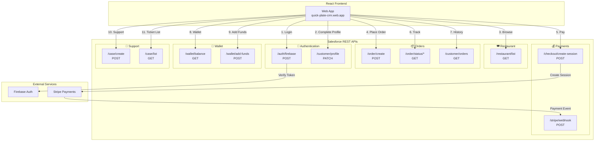
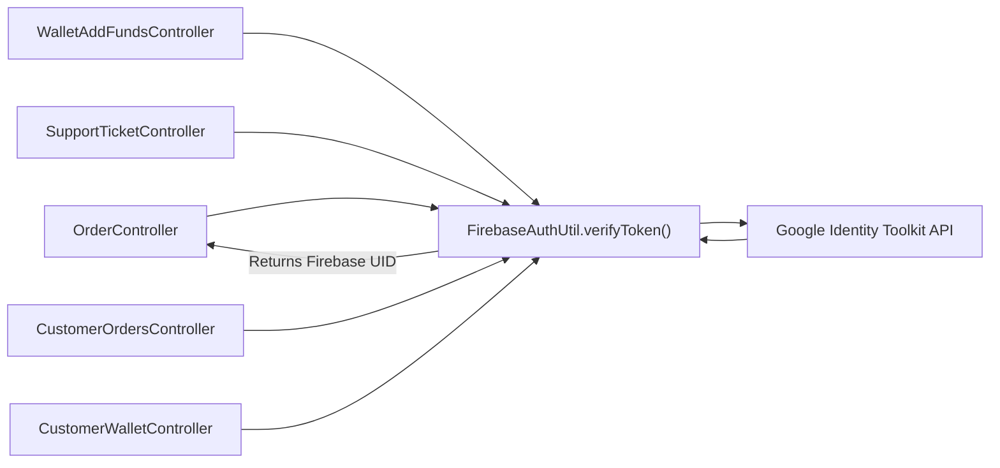

# 🚀 Salesforce Apex REST API — Complete Masterclass

> Based on your **Quick Plate Platform** project's actual Apex classes

---

## Table of Contents

1. [What is a Salesforce REST API?](#1-what-is-a-salesforce-rest-api)
2. [The 5 Building Blocks (Annotations)](#2-the-5-building-blocks-annotations)
3. [Anatomy of a REST Class](#3-anatomy-of-a-rest-class)
4. [Your Project's API Architecture](#4-your-projects-api-architecture)
5. [Deep Dive — Every REST Class Explained](#5-deep-dive--every-rest-class-explained)
6. [The FirebaseAuthUtil — Shared Security Layer](#6-the-firebaseauthutil--shared-security-layer)
7. [Key Patterns Used in Your Project](#7-key-patterns-used-in-your-project)
8. [Workbench Testing Guide](#8-workbench-testing-guide)
9. [All Workbench Test Payloads](#9-all-workbench-test-payloads)
10. [Common Mistakes & Debugging Tips](#10-common-mistakes--debugging-tips)

---

## 1. What is a Salesforce REST API?

A Salesforce REST API lets **external systems** (like your React frontend) talk to Salesforce over HTTP. Instead of using the standard Salesforce UI, your frontend sends HTTP requests (GET, POST, PATCH, etc.) to custom URLs, and Salesforce runs Apex code to process them.

```
┌─────────────────┐         HTTPS          ┌──────────────────────┐
│                 │ ───────────────────────▶│                      │
│  React Frontend │   GET/POST/PATCH/PUT   │  Salesforce Apex     │
│  (Web App)      │ ◀───────────────────── │  REST Controllers    │
│                 │     JSON Response       │                      │
└─────────────────┘                        └──────────────────────┘
```

### The Full URL Structure

```
https://YOUR_ORG.my.salesforce.com/services/apexrest/YOUR_URL_MAPPING
         ▲                                  ▲            ▲
         │                                  │            │
   Your Salesforce Org            Fixed prefix     Your custom path
                                (always the same)  (defined in @RestResource)
```

**Example from your project:**
```
https://quick-plate-dev-ed.my.salesforce.com/services/apexrest/restaurant/list
```

---

## 2. The 5 Building Blocks (Annotations)

Salesforce uses **annotations** (special keywords starting with `@`) to turn a normal Apex class into a REST API:

### 2.1 `@RestResource(urlMapping='/your/path')`
> 🎯 **Purpose:** Registers the class as a REST endpoint and defines the URL

```apex
@RestResource(urlMapping='/restaurant/list')  // ← This is the URL path
global without sharing class RestaurantController {
    // ...
}
```

| Rule | Detail |
|------|--------|
| **Placed on** | The class (not the method) |
| **URL prefix** | Always starts with `/services/apexrest/` |
| **Wildcards** | Use `/*` at the end to capture path parameters (e.g., `/order/status/*`) |
| **One per class** | Each class can only have ONE `@RestResource` |

### 2.2 `@HttpGet`
> 📖 **Purpose:** Handles GET requests — used to **READ** data

```apex
@HttpGet
global static List<RestaurantResponse> getRestaurants() {
    // Query and return data
}
```

- **No request body** — data comes via URL parameters or path
- Used in: [RestaurantController](file:///Users/varunshiyam/Downloads/Projects/QUICK_PLATE_PLATFORM/Salesforce-CRM/force-app/main/default/classes/RestaurantController.cls), [CustomerWalletController](file:///Users/varunshiyam/Downloads/Projects/QUICK_PLATE_PLATFORM/Salesforce-CRM/force-app/main/default/classes/CustomerWalletController.cls), [OrderStatusController](file:///Users/varunshiyam/Downloads/Projects/QUICK_PLATE_PLATFORM/Salesforce-CRM/force-app/main/default/classes/OrderStatusController.cls), [CustomerOrdersController](file:///Users/varunshiyam/Downloads/Projects/QUICK_PLATE_PLATFORM/Salesforce-CRM/force-app/main/default/classes/CustomerOrdersController.cls), [SupportTicketStatusController](file:///Users/varunshiyam/Downloads/Projects/QUICK_PLATE_PLATFORM/Salesforce-CRM/force-app/main/default/classes/SupportTicketStatusController.cls)

### 2.3 `@HttpPost`
> ✍️ **Purpose:** Handles POST requests — used to **CREATE** data

```apex
@HttpPost
global static OrderCreateResponse createOrder() {
    // Read request body, create records
}
```

- **Has request body** — JSON payload sent in the body
- Used in: [OrderController](file:///Users/varunshiyam/Downloads/Projects/QUICK_PLATE_PLATFORM/Salesforce-CRM/force-app/main/default/classes/OrderController.cls), [FirebaseAuthController](file:///Users/varunshiyam/Downloads/Projects/QUICK_PLATE_PLATFORM/Salesforce-CRM/force-app/main/default/classes/FirebaseAuthController.cls), [SupportTicketController](file:///Users/varunshiyam/Downloads/Projects/QUICK_PLATE_PLATFORM/Salesforce-CRM/force-app/main/default/classes/SupportTicketController.cls), [StripeCheckoutController](file:///Users/varunshiyam/Downloads/Projects/QUICK_PLATE_PLATFORM/Salesforce-CRM/force-app/main/default/classes/StripeCheckoutController.cls), [StripeWebhookController](file:///Users/varunshiyam/Downloads/Projects/QUICK_PLATE_PLATFORM/Salesforce-CRM/force-app/main/default/classes/StripeWebhookController.cls), [WalletAddFundsController](file:///Users/varunshiyam/Downloads/Projects/QUICK_PLATE_PLATFORM/Salesforce-CRM/force-app/main/default/classes/WalletAddFundsController.cls)

### 2.4 `@HttpPatch`
> 🔧 **Purpose:** Handles PATCH requests — used to **PARTIALLY UPDATE** data

```apex
@HttpPatch
global static void completeProfile() {
    // Read body, update specific fields
}
```

- Used in: [CustomerProfileController](file:///Users/varunshiyam/Downloads/Projects/QUICK_PLATE_PLATFORM/Salesforce-CRM/force-app/main/default/classes/CustomerProfileController.cls)

### 2.5 `@HttpPut` and `@HttpDelete`
> Not used in your project, but available for full replacements (`PUT`) and deletions (`DELETE`).

### Quick Reference Table — Your Project

| Annotation | HTTP Method | Purpose | Count in Your Project |
|-----------|-------------|---------|----------------------|
| `@HttpGet` | GET | Read data | 5 classes |
| `@HttpPost` | POST | Create data | 6 classes |
| `@HttpPatch` | PATCH | Update data | 1 class |
| `@HttpPut` | PUT | Replace data | 0 classes |
| `@HttpDelete` | DELETE | Delete data | 0 classes |

---

## 3. Anatomy of a REST Class

Every REST class in your project follows this consistent pattern:

```apex
// ═══════════════════════════════════════════
// STEP 1: Register the URL
// ═══════════════════════════════════════════
@RestResource(urlMapping='/your/endpoint')
global without sharing class YourController {

    // ═══════════════════════════════════════
    // STEP 2: Define Request wrapper
    //         (what the frontend SENDS)
    // ═══════════════════════════════════════
    global class YourRequest {
        public String idToken;      // Firebase auth
        public String someField;    // Business data
    }

    // ═══════════════════════════════════════
    // STEP 3: Define Response wrapper
    //         (what the frontend RECEIVES)
    // ═══════════════════════════════════════
    global class YourResponse {
        public Boolean success;     // Always present
        public String message;      // Error details
        public String recordId;     // Business data
    }

    // ═══════════════════════════════════════
    // STEP 4: The actual API method
    // ═══════════════════════════════════════
    @HttpPost  // or @HttpGet, @HttpPatch
    global static YourResponse doSomething() {

        YourResponse res = new YourResponse();

        try {
            // A. Read the incoming request
            RestRequest req = RestContext.request;
            String rawBody = req.requestBody.toString();

            // B. Deserialize JSON → Apex object
            YourRequest input = (YourRequest)
                JSON.deserialize(rawBody, YourRequest.class);

            // C. Validate input
            if (String.isBlank(input.idToken)) {
                return buildError(res, 'Missing token', 400);
            }

            // D. Authenticate (verify Firebase token)
            String uid = FirebaseAuthUtil.verifyToken(input.idToken);

            // E. Business logic (SOQL queries, DML)
            // ... query records, create/update records ...

            // F. Return success
            res.success = true;
            RestContext.response.statusCode = 200;
            return res;

        } catch (Exception e) {
            return buildError(res, 'Failed', 500);
        }
    }

    // ═══════════════════════════════════════
    // STEP 5: Reusable error handler
    // ═══════════════════════════════════════
    private static YourResponse buildError(
        YourResponse res, String msg, Integer code
    ) {
        res.success = false;
        res.message = msg;
        RestContext.response.statusCode = code;
        return res;
    }
}
```

### Key Concepts Explained

| Concept | What It Does | Example from Your Code |
|---------|-------------|----------------------|
| `global` | Makes the class/method accessible outside the package (required for REST APIs) | `global static AuthResponse authenticate()` |
| `without sharing` | Bypasses Salesforce sharing rules so the API can access all records | `global without sharing class OrderController` |
| `with sharing` | Respects sharing rules (more secure) | `global with sharing class FirebaseAuthController` |
| `RestContext.request` | Gives you the incoming HTTP request (body, headers, params, URL) | `RestRequest req = RestContext.request;` |
| `RestContext.response` | Lets you set the HTTP response (status code, headers, body) | `RestContext.response.statusCode = 200;` |
| `JSON.deserialize()` | Converts JSON string → Apex object | `(OrderCreateRequest) JSON.deserialize(body, OrderCreateRequest.class)` |
| `JSON.serialize()` | Converts Apex object → JSON string | `Blob.valueOf(JSON.serialize(body))` |

---

## 4. Your Project's API Architecture



---

## 5. Deep Dive — Every REST Class Explained

### 5.1 🔐 FirebaseAuthController — The Login Gateway

**File:** [FirebaseAuthController.cls](file:///Users/varunshiyam/Downloads/Projects/QUICK_PLATE_PLATFORM/Salesforce-CRM/force-app/main/default/classes/FirebaseAuthController.cls)
**URL:** `/services/apexrest/auth/firebase`
**Method:** `POST`

#### What It Does (Step by Step):
1. Receives a Firebase `idToken` from the frontend
2. Calls Google's Identity Toolkit API to verify the token
3. Extracts `firebaseUid`, `email`, `displayName` from the response
4. Searches for an existing `Customer__c` by UID or email
5. Creates a new Customer if not found
6. Returns `customerId`, `profileComplete` status, `name`, `email`

#### How Input Comes In:
```apex
// The frontend sends JSON in the request body:
RestRequest req = RestContext.request;

// Read the raw body string
AuthRequest authReq = (AuthRequest)
    JSON.deserialize(
        req.requestBody.toString(),  // ← reads body as string
        AuthRequest.class            // ← converts to Apex object
    );
```

#### Special Pattern — Inner Class for Sharing:
```apex
// The outer class uses "with sharing" (respects security)
global with sharing class FirebaseAuthController {

    // But the inner class uses "without sharing"
    // to bypass sharing rules for system-level queries
    private without sharing class CustomerResolver {
        public Customer__c findCustomer(String uid, String email) {
            // Can query ALL Customer records regardless of sharing
        }
    }
}
```

> [!IMPORTANT]
> This is a security design pattern. The main API respects sharing rules, but the customer lookup needs system-level access to find any customer record. The `CustomerResolver` inner class provides this controlled bypass.

---

### 5.2 👤 CustomerProfileController — Profile Completion

**File:** [CustomerProfileController.cls](file:///Users/varunshiyam/Downloads/Projects/QUICK_PLATE_PLATFORM/Salesforce-CRM/force-app/main/default/classes/CustomerProfileController.cls)
**URL:** `/services/apexrest/customer/profile`
**Method:** `PATCH`

#### What It Does:
1. Receives `idToken`, `fullName`, `phone`, `address`
2. Verifies Firebase token (inline, not using `FirebaseAuthUtil`)
3. Finds the Customer by `Firebase_UID__c`
4. Updates the profile fields
5. Returns success/failure

#### Key Difference — Void Return + Manual Response:
```apex
@HttpPatch
global static void completeProfile() {  // ← returns void, NOT an object
    // ...
    // Must manually set the response body:
    RestContext.response.statusCode = statusCode;
    RestContext.response.addHeader('Content-Type', 'application/json');
    RestContext.response.responseBody = Blob.valueOf(JSON.serialize(body));
}
```

> [!NOTE]
> When a method returns `void`, you MUST manually write to `RestContext.response.responseBody`. When it returns an object (like most other classes), Salesforce auto-serializes it to JSON.

---

### 5.3 🍽️ RestaurantController — List Active Restaurants

**File:** [RestaurantController.cls](file:///Users/varunshiyam/Downloads/Projects/QUICK_PLATE_PLATFORM/Salesforce-CRM/force-app/main/default/classes/RestaurantController.cls)
**URL:** `/services/apexrest/restaurant/list`
**Method:** `GET`

#### What It Does:
1. Queries all active, non-closed restaurants
2. Maps them to a response wrapper
3. Returns the list

#### Simplest Pattern — No Authentication, No Body:
```apex
@HttpGet
global static List<RestaurantResponse> getRestaurants() {
    // No body to read (GET requests don't have bodies)
    // No token to verify (public endpoint)
    // Just query and return
    List<Restaurant__c> restaurants = [
        SELECT Id, Name, City__c, Avg_Prep_Time_Min__c
        FROM Restaurant__c
        WHERE Is_Active__c = true
          AND Is_Temporarily_Closed__c = false
        ORDER BY Name ASC
        LIMIT 500
    ];
    // ... map to response wrappers and return
}
```

> [!TIP]
> This is the simplest REST API pattern. If you're learning, start here. No authentication, no request body, just query → return.

---

### 5.4 📦 OrderController — Create New Order

**File:** [OrderController.cls](file:///Users/varunshiyam/Downloads/Projects/QUICK_PLATE_PLATFORM/Salesforce-CRM/force-app/main/default/classes/OrderController.cls)
**URL:** `/services/apexrest/order/create`
**Method:** `POST`

#### What It Does:
1. Validates all input fields (`idToken`, `restaurantId`, `orderTotal`)
2. Verifies Firebase token via `FirebaseAuthUtil`
3. Finds Customer from Firebase UID
4. Validates the Restaurant exists and is active
5. Creates a new `Order__c` record with status `PAYMENT_PENDING`
6. Returns `orderId` and `orderNumber`

#### Multi-Step Validation Pattern:
```apex
// Step 1: Check body exists
if (req.requestBody == null) {
    return buildError(res, 'Request body missing.', 400);
}

// Step 2: Check required fields
if (String.isBlank(input.idToken) ||
    String.isBlank(input.restaurantId) ||
    input.orderTotal == null ||
    input.orderTotal <= 0) {
    return buildError(res, 'Invalid request data.', 400);
}

// Step 3: Verify authentication
String firebaseUid = FirebaseAuthUtil.verifyToken(input.idToken);
if (String.isBlank(firebaseUid)) {
    return buildError(res, 'Invalid authentication.', 401);
}

// Step 4: Business validation (customer exists?)
// Step 5: Business validation (restaurant active?)
// Step 6: Create the record
```

---

### 5.5 📍 OrderStatusController — Track Order by ID

**File:** [OrderStatusController.cls](file:///Users/varunshiyam/Downloads/Projects/QUICK_PLATE_PLATFORM/Salesforce-CRM/force-app/main/default/classes/OrderStatusController.cls)
**URL:** `/services/apexrest/order/status/*`
**Method:** `GET`

#### What It Does:
1. Extracts the order ID from the URL path (wildcard `/*`)
2. Queries the order with delivery agent info
3. Returns order status, payment status, and agent details

#### Key Pattern — URL Path Parameters (Wildcard):
```apex
// URL: /services/apexrest/order/status/a0BDM000004XfGh2AK
//                                      ▲
//                                      This is the orderId

@RestResource(urlMapping='/order/status/*')  // ← the * captures the path segment

@HttpGet
global static StatusResponse getStatus() {
    RestRequest req = RestContext.request;

    // Extract the ID from the URL
    String orderId = req.requestURI.substring(
        req.requestURI.lastIndexOf('/') + 1
    );
    // orderId = "a0BDM000004XfGh2AK"
}
```

> [!TIP]
> Use `/*` wildcard when you want clean REST-style URLs like `/order/status/abc123` instead of query parameters like `/order/status?id=abc123`.

---

### 5.6 📋 CustomerOrdersController — Order History

**File:** [CustomerOrdersController.cls](file:///Users/varunshiyam/Downloads/Projects/QUICK_PLATE_PLATFORM/Salesforce-CRM/force-app/main/default/classes/CustomerOrdersController.cls)
**URL:** `/services/apexrest/customer/orders`
**Method:** `GET`

#### What It Does:
1. Gets Firebase token from URL query parameter `?idToken=xxx`
2. Verifies token → gets UID → finds Customer
3. Queries all orders for that customer (max 50, newest first)
4. Returns list with restaurant name, amounts, statuses

#### Key Pattern — Query Parameters on GET:
```apex
// URL: /services/apexrest/customer/orders?idToken=eyJhbGci...
//                                        ▲
//                                        Query parameter

@HttpGet
global static ResponseWrapper getCustomerOrders() {
    RestRequest req = RestContext.request;

    // Read query parameter
    String idToken = req.params.get('idToken');  // ← req.params is a Map
}
```

> [!NOTE]
> For GET requests, you pass data as **query parameters** (`?key=value&key2=value2`) since GET requests don't have a request body. Use `req.params.get('paramName')` to read them.

---

### 5.7 👛 CustomerWalletController — Check Balance

**File:** [CustomerWalletController.cls](file:///Users/varunshiyam/Downloads/Projects/QUICK_PLATE_PLATFORM/Salesforce-CRM/force-app/main/default/classes/CustomerWalletController.cls)
**URL:** `/services/apexrest/wallet/balance`
**Method:** `GET`

#### What It Does:
1. Gets token from query parameter `?token=xxx`
2. Verifies → finds Customer → finds their `Customer_Credit__c` record
3. Returns `availableBalance`

---

### 5.8 💰 WalletAddFundsController — Add Money to Wallet

**File:** [WalletAddFundsController.cls](file:///Users/varunshiyam/Downloads/Projects/QUICK_PLATE_PLATFORM/Salesforce-CRM/force-app/main/default/classes/WalletAddFundsController.cls)
**URL:** `/services/apexrest/wallet/add-funds`
**Method:** `POST`

#### What It Does:
1. Receives `idToken` and `amount`
2. Verifies → finds Customer
3. Finds or creates `Customer_Credit__c` record
4. Uses `FOR UPDATE` to lock the record (prevents concurrent writes)
5. Adds funds and returns `newBalance`

#### Key Pattern — Record Locking:
```apex
// FOR UPDATE locks the row so no other transaction can modify it simultaneously
List<Customer_Credit__c> credits = [
    SELECT Id, Available_Amount__c, Amount__c
    FROM Customer_Credit__c
    WHERE Customer__c = :customer.Id
    LIMIT 1
    FOR UPDATE  // ← Database-level lock!
];
```

> [!IMPORTANT]
> `FOR UPDATE` is critical for financial operations. Without it, two simultaneous "add funds" requests could read the same balance and both add to it, causing incorrect totals.

---

### 5.9 💳 StripeCheckoutController — Create Payment Session

**File:** [StripeCheckoutController.cls](file:///Users/varunshiyam/Downloads/Projects/QUICK_PLATE_PLATFORM/Salesforce-CRM/force-app/main/default/classes/StripeCheckoutController.cls)
**URL:** `/services/apexrest/checkout/create-session`
**Method:** `POST`

#### What It Does:
1. Receives `orderId`
2. Validates order exists, isn't already paid, has valid amount
3. Checks no pending payment already exists (idempotency)
4. Makes an outbound HTTP call to Stripe API
5. Creates a `Payment_Transaction__c` record with Stripe session ID
6. Returns the Stripe `checkoutUrl` for the frontend to redirect to

#### Key Pattern — Outbound HTTP Callout:
```apex
// Your API calls Stripe's API (Apex → External Service)
HttpRequest httpReq = new HttpRequest();
httpReq.setEndpoint('callout:Stripe_API/v1/checkout/sessions');  // Named Credential
httpReq.setMethod('POST');
httpReq.setHeader('Authorization', 'Bearer ' + STRIPE_SECRET_KEY);
httpReq.setHeader('Content-Type', 'application/x-www-form-urlencoded');

// Stripe uses form-encoded body, not JSON
String body = 'mode=payment' +
    '&success_url=' + EncodingUtil.urlEncode(successUrl, 'UTF-8') +
    '&line_items[0][price_data][currency]=inr' +
    '&line_items[0][price_data][unit_amount]=' + amountInPaisa;

httpReq.setBody(body);
Http http = new Http();
HttpResponse httpRes = http.send(httpReq);
```

---

### 5.10 🔔 StripeWebhookController — Payment Confirmation

**File:** [StripeWebhookController.cls](file:///Users/varunshiyam/Downloads/Projects/QUICK_PLATE_PLATFORM/Salesforce-CRM/force-app/main/default/classes/StripeWebhookController.cls)
**URL:** `/services/apexrest/stripe/webhook`
**Method:** `POST`

#### What It Does:
1. Receives a webhook event from Stripe (when payment completes)
2. Validates the event type is `checkout.session.completed`
3. Finds the matching `Payment_Transaction__c` by `Stripe_Session_Id__c`
4. Updates transaction to `SUCCESS`
5. Updates the order to `CONFIRMED` + `PAID`
6. Assigns a delivery agent from the restaurant's city

#### Key Pattern — Void Return with Status Codes Only:
```apex
@HttpPost
global static void handleWebhook() {  // ← void return
    // Only communicates via status codes:
    RestContext.response.statusCode = 200;  // Success
    RestContext.response.statusCode = 400;  // Bad request
    RestContext.response.statusCode = 500;  // Server error
}
```

---

### 5.11 🎫 SupportTicketController — Create Support Ticket

**File:** [SupportTicketController.cls](file:///Users/varunshiyam/Downloads/Projects/QUICK_PLATE_PLATFORM/Salesforce-CRM/force-app/main/default/classes/SupportTicketController.cls)
**URL:** `/services/apexrest/case/create`
**Method:** `POST`

#### What It Does:
1. Validates and authenticates
2. Verifies the order belongs to the customer (security check!)
3. Prevents duplicate refund requests
4. Counts existing issues for the customer
5. Creates `Support_Ticket__c` and assigns to a Queue
6. Links ticket to the order

#### Key Pattern — Security Ownership Check:
```apex
// CRITICAL: Verify the customer owns this order
if (ord.Customer__c != customerId) {
    return buildError(res, 'Unauthorized access', 403);
}
```

---

### 5.12 📋 SupportTicketStatusController — List Tickets

**File:** [SupportTicketStatusController.cls](file:///Users/varunshiyam/Downloads/Projects/QUICK_PLATE_PLATFORM/Salesforce-CRM/force-app/main/default/classes/SupportTicketStatusController.cls)
**URL:** `/services/apexrest/case/list`
**Method:** `GET`

#### What It Does:
1. Gets `customerId` from query parameter
2. Validates customer exists
3. Returns last 50 tickets with details

---

## 6. The FirebaseAuthUtil — Shared Security Layer

**File:** [FirebaseAuthUtil.cls](file:///Users/varunshiyam/Downloads/Projects/QUICK_PLATE_PLATFORM/Salesforce-CRM/force-app/main/default/classes/FirebaseAuthUtil.cls)

This is **NOT** a REST API class. It's a **utility class** used by multiple REST controllers to verify Firebase tokens.



### How It Works:
```apex
public static String verifyToken(String idToken) {
    // 1. Call Google's API with the token
    // 2. If status 200 → parse response → return Firebase UID
    // 3. If anything fails → return null
}
```

---

## 7. Key Patterns Used in Your Project

### Pattern 1: Two Ways to Read Input Data

| Method | How Data Arrives | How to Read | Used In |
|--------|-----------------|-------------|---------|
| `GET` | Query params `?key=value` | `req.params.get('key')` | Wallet balance, Order list, Ticket list |
| `GET` | URL path `/status/abc123` | `req.requestURI.substring(...)` | Order status |
| `POST` / `PATCH` | JSON body | `JSON.deserialize(req.requestBody.toString(), ...)` | Auth, Orders, Tickets |

### Pattern 2: Two Ways to Return Data

| Approach | Return Type | How Response is Sent | Used In |
|----------|------------|---------------------|---------|
| **Auto-serialize** | `global static YourObject method()` | Salesforce converts the returned object to JSON automatically | Most classes |
| **Manual response** | `global static void method()` | You manually set `RestContext.response.responseBody` | CustomerProfileController, StripeWebhookController |

### Pattern 3: Consistent Error Handling

Every class uses a private `buildError()` / `error()` method:
```apex
private static YourResponse buildError(YourResponse res, String msg, Integer code) {
    res.success = false;
    res.message = msg;
    RestContext.response.statusCode = code;
    return res;
}
```

### Pattern 4: HTTP Status Codes Used

| Code | Meaning | When Used |
|------|---------|-----------|
| `200` | Success | Everything worked |
| `400` | Bad Request | Missing or invalid input |
| `401` | Unauthorized | Invalid/missing token |
| `403` | Forbidden | Customer doesn't own the resource |
| `404` | Not Found | Record doesn't exist |
| `500` | Server Error | Unexpected exception |

---

## 8. Workbench Testing Guide

### Step-by-Step: How to Test REST APIs in Workbench

#### Step 1: Open Workbench
Go to: **https://workbench.developerforce.com**

#### Step 2: Login
- **Environment:** `Production` or `Sandbox`
- **API Version:** `62.0` (or latest)
- Click **Login with Salesforce**
- Authorize the app

#### Step 3: Navigate to REST Explorer
- Click **Utilities** → **REST Explorer**

#### Step 4: Configure Your Request

```
┌─────────────────────────────────────────────────────────────┐
│  HTTP Method:  [GET ▼]  or  [POST ▼]  or  [PATCH ▼]       │
│                                                             │
│  URL:  /services/apexrest/restaurant/list                   │
│                                                             │
│  Headers:                                                   │
│    Content-Type: application/json                           │
│                                                             │
│  Request Body: (for POST/PATCH only)                        │
│  {                                                          │
│    "idToken": "your_firebase_token_here",                   │
│    "restaurantId": "a0BDM000001abc"                        │
│  }                                                          │
│                                                             │
│  [Execute]                                                  │
└─────────────────────────────────────────────────────────────┘
```

#### Step 5: Read the Response
- Check the **HTTP Status Code** (200 = success)
- Read the **JSON response body**
- Look for `"success": true` or error messages

> [!WARNING]
> **Endpoints requiring Firebase tokens** (most POST endpoints) **will NOT work in Workbench** unless you provide a valid, non-expired Firebase `idToken`. Firebase tokens expire after **1 hour**. For Workbench testing of authenticated endpoints, you need to first get a fresh token from your running React app (browser DevTools → Network tab → copy the token from any API request).

---

## 9. All Workbench Test Payloads

### 9.1 ✅ GET — Restaurant List (Easiest to test!)

```
Method:  GET
URL:     /services/apexrest/restaurant/list
Headers: Content-Type: application/json
Body:    (none)
```

**Expected Response:**
```json
[
  {
    "id": "a0BDM000001XYZ",
    "name": "Pizza Palace",
    "city": "Chennai",
    "avgPrepTime": 25
  },
  {
    "id": "a0BDM000001ABC",
    "name": "Biryani House",
    "city": "Hyderabad",
    "avgPrepTime": 30
  }
]
```

---

### 9.2 🔐 POST — Firebase Authentication

```
Method:  POST
URL:     /services/apexrest/auth/firebase
Headers: Content-Type: application/json
Body:
```
```json
{
  "idToken": "eyJhbGciOiJSUzI1NiIsInR5cCI6IkpXVCJ9..."
}
```

**Expected Response:**
```json
{
  "success": true,
  "profileComplete": false,
  "customerId": "a0ADM000002XYZ",
  "name": "Varun S",
  "email": "varun@example.com",
  "message": "Authentication successful."
}
```

> [!TIP]
> **How to get a valid `idToken`:** Open your React app → Login → Open browser DevTools → Network tab → Find any API call → Copy the `idToken` from the request payload. Use it within 1 hour.

---

### 9.3 👤 PATCH — Complete Profile

```
Method:  PATCH
URL:     /services/apexrest/customer/profile
Headers: Content-Type: application/json
Body:
```
```json
{
  "idToken": "eyJhbGciOiJSUzI1NiIsInR5cCI6IkpXVCJ9...",
  "fullName": "Varun Shiyam",
  "phone": "+91 9876543210",
  "address": "123 MG Road, Chennai"
}
```

**Expected Response:**
```json
{
  "success": true,
  "message": "Profile updated successfully"
}
```

---

### 9.4 📦 POST — Create Order

```
Method:  POST
URL:     /services/apexrest/order/create
Headers: Content-Type: application/json
Body:
```
```json
{
  "idToken": "eyJhbGciOiJSUzI1NiIsInR5cCI6IkpXVCJ9...",
  "restaurantId": "a0BDM000001XYZ",
  "orderTotal": 450.00,
  "creditsUsed": 50.00
}
```

**Expected Response:**
```json
{
  "success": true,
  "orderId": "a0CDM000003ABC",
  "orderNumber": "ORD-00042",
  "message": null
}
```

> [!NOTE]
> Replace `restaurantId` with a **real Restaurant ID** from your org. You can get one from the GET restaurant/list response.

---

### 9.5 📍 GET — Order Status (URL Path Parameter)

```
Method:  GET
URL:     /services/apexrest/order/status/a0CDM000003ABC
Headers: Content-Type: application/json
Body:    (none)
```

**Expected Response:**
```json
{
  "success": true,
  "message": null,
  "orderId": "a0CDM000003ABC",
  "orderStatus": "CONFIRMED",
  "paymentStatus": "PAID",
  "agent": {
    "name": "Ravi Kumar",
    "rating": null,
    "vehicle": null
  }
}
```

> [!NOTE]
> Replace `a0CDM000003ABC` with an **actual Order ID** from your org.

---

### 9.6 📋 GET — Customer Order History

```
Method:  GET
URL:     /services/apexrest/customer/orders?idToken=eyJhbGciOiJSUzI1NiIsInR5cCI6IkpXVCJ9...
Headers: Content-Type: application/json
Body:    (none)
```

**Expected Response:**
```json
{
  "success": true,
  "message": null,
  "orders": [
    {
      "id": "a0CDM000003ABC",
      "restaurantName": "Pizza Palace",
      "createdDate": "2026-06-20T14:30:00.000Z",
      "totalAmount": 450.00,
      "orderStatus": "DELIVERED",
      "paymentStatus": "PAID"
    }
  ]
}
```

---

### 9.7 👛 GET — Wallet Balance

```
Method:  GET
URL:     /services/apexrest/wallet/balance?token=eyJhbGciOiJSUzI1NiIsInR5cCI6IkpXVCJ9...
Headers: Content-Type: application/json
Body:    (none)
```

**Expected Response:**
```json
{
  "success": true,
  "availableBalance": 250.00,
  "message": null
}
```

---

### 9.8 💰 POST — Add Funds to Wallet

```
Method:  POST
URL:     /services/apexrest/wallet/add-funds
Headers: Content-Type: application/json
Body:
```
```json
{
  "idToken": "eyJhbGciOiJSUzI1NiIsInR5cCI6IkpXVCJ9...",
  "amount": 500.00
}
```

**Expected Response:**
```json
{
  "success": true,
  "newBalance": 750.00,
  "message": null
}
```

---

### 9.9 💳 POST — Create Stripe Checkout Session

```
Method:  POST
URL:     /services/apexrest/checkout/create-session
Headers: Content-Type: application/json
Body:
```
```json
{
  "orderId": "a0CDM000003ABC"
}
```

**Expected Response:**
```json
{
  "success": true,
  "checkoutUrl": "https://checkout.stripe.com/c/pay/cs_test_...",
  "message": null
}
```

> [!WARNING]
> This will make a real call to Stripe API. Use test-mode order IDs only.

---

### 9.10 🔔 POST — Stripe Webhook (Simulating)

```
Method:  POST
URL:     /services/apexrest/stripe/webhook
Headers:
  Content-Type: application/json
  Stripe-Signature: t=1234567890,v1=abc123
Body:
```
```json
{
  "type": "checkout.session.completed",
  "data": {
    "object": {
      "id": "cs_test_xxxxxxxxxxxxx",
      "payment_intent": "pi_test_xxxxxxxxxxxxx"
    }
  }
}
```

**Expected Response:**
```
HTTP Status: 200
Body: (empty — void method)
```

> [!CAUTION]
> In production, Stripe sends a real `Stripe-Signature` header. The current code does not fully validate it (see the comment in the code). For testing, any non-blank value works.

---

### 9.11 🎫 POST — Create Support Ticket

```
Method:  POST
URL:     /services/apexrest/case/create
Headers: Content-Type: application/json
Body:
```
```json
{
  "idToken": "eyJhbGciOiJSUzI1NiIsInR5cCI6IkpXVCJ9...",
  "orderId": "a0CDM000003ABC",
  "type": "Delivery Issue",
  "description": "Food arrived cold",
  "reason": "Late delivery",
  "caseId": "CASE-001"
}
```

**Expected Response:**
```json
{
  "success": true,
  "ticketId": "a0EDM000004XYZ",
  "message": null
}
```

**For a Refund Request:**
```json
{
  "idToken": "eyJhbGciOiJSUzI1NiIsInR5cCI6IkpXVCJ9...",
  "orderId": "a0CDM000003ABC",
  "type": "Refund Request",
  "description": "Wrong order delivered",
  "reason": "Incorrect items"
}
```

---

### 9.12 📋 GET — List Support Tickets

```
Method:  GET
URL:     /services/apexrest/case/list?customerId=a0ADM000002XYZ
Headers: Content-Type: application/json
Body:    (none)
```

**Expected Response:**
```json
{
  "success": true,
  "message": null,
  "tickets": [
    {
      "ticketId": "a0EDM000004XYZ",
      "orderId": "a0CDM000003ABC",
      "restaurantName": "Pizza Palace",
      "issueType": "Delivery Issue",
      "status": "NEW",
      "description": "In-Progress",
      "reason": "Late delivery",
      "createdAt": "2026-06-20T14:45:00.000Z",
      "caseNumber": "CASE-001"
    }
  ]
}
```

---

## 10. Common Mistakes & Debugging Tips

### ❌ Common Mistakes

| Mistake | Fix |
|---------|-----|
| Forgetting `global` on class/method | REST methods MUST be `global static` |
| Missing `@RestResource` on class | Every REST class needs this annotation |
| Multiple `@HttpGet` in one class | Only ONE method per HTTP verb per class |
| Using `public` instead of `global` | Won't be accessible as a REST endpoint |
| Forgetting `Content-Type: application/json` header | Workbench may not send JSON properly |
| Using expired Firebase token | Tokens expire after 1 hour — get a fresh one |
| Wrong URL path | Must include `/services/apexrest/` prefix |

### 🔍 Debugging Tips

1. **Check Debug Logs:** Setup → Debug Logs → Add your user → Re-run the request → Check logs
2. **System.debug():** All your classes already have debug statements — look for them in logs
3. **Check Named Credentials:** If Stripe calls fail, verify `Stripe_API` Named Credential in Setup
4. **Check Remote Site Settings:** Firebase and Stripe URLs must be whitelisted

### 🧪 Testing Order for Beginners

Start with the simplest and work your way up:

```
1. GET  /restaurant/list          ← No auth needed, easiest
2. POST /auth/firebase            ← Need Firebase token
3. PATCH /customer/profile        ← Need Firebase token
4. GET  /customer/orders          ← Need Firebase token (query param)
5. POST /order/create             ← Need token + restaurantId
6. GET  /order/status/{id}        ← Need orderId from step 5
7. POST /checkout/create-session  ← Need orderId, calls Stripe
8. GET  /wallet/balance           ← Need Firebase token
9. POST /wallet/add-funds         ← Need Firebase token
10. POST /case/create             ← Need token + orderId
11. GET  /case/list               ← Need customerId
12. POST /stripe/webhook          ← Simulating Stripe event
```

---

> [!TIP]
> **Pro tip for mastering these:** Create a test Customer record in your org manually with a known Firebase UID, then you can skip the auth step during Workbench testing by directly using the Customer ID in your SOQL queries.
