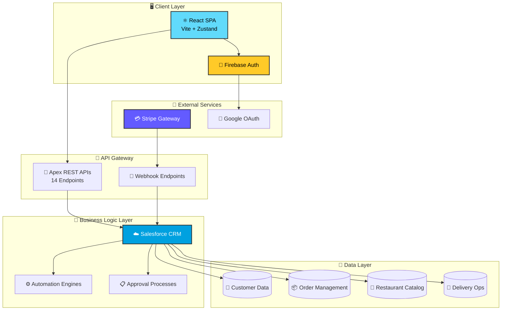
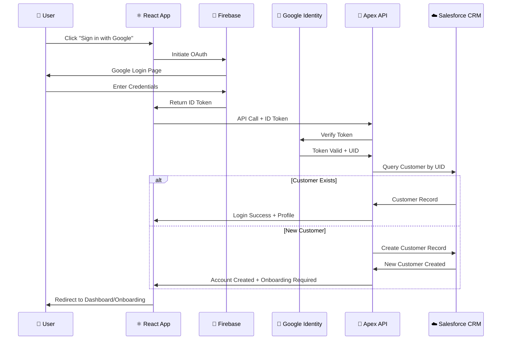
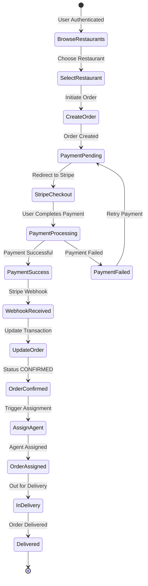

<div align="center">


<br/>


<br/><br/>

<p>
  <a href="https://quick-plate-crm.web.app/"></a>
  <a href="https://github.com/Varunshiyam/QUICK-PLATE-CRM/stargazers"></a>
  <a href="https://github.com/Varunshiyam/QUICK-PLATE-CRM/network/members"></a>
  <a href="https://github.com/Varunshiyam/QUICK-PLATE-CRM/graphs/contributors"></a>
</p>

<p>
  
  
  
  
  
  
  
  
</p>

<br/>

> *Revolutionizing quick commerce with real-time ordering, enterprise CRM, and intelligent delivery — built by the community, for the community.*

<br/>

[🌟 Overview](#-overview) · [✨ Features](#-key-features) · [🏗️ Architecture](#%EF%B8%8F-system-architecture) · [☁️ Salesforce Deep Dive](#%EF%B8%8F-salesforce-architecture--teams) · [💻 Tech Stack](#-technology-stack) · [📊 Data Model](#-data-model) · [🔐 Security](#-authentication--security) · [🔌 APIs](#-api-reference) · [🚀 Get Started](#-getting-started) · [🤝 Contributing](#community) · [👨‍💻 Contributors](#contributors)

</div>

---

## 📖 Table of Contents

<details>
<summary>🗂️ Click to expand full navigation</summary>

- [Overview](#-overview)
  - [Vision](#-vision)
  - [What Makes QuickPlate Different?](#-what-makes-quickplate-different)
- [Key Features](#-key-features)
- [System Architecture](#%EF%B8%8F-system-architecture)
  - [Architecture Principles](#-architecture-principles)
- [☁️ Salesforce Architecture & Teams](#%EF%B8%8F-salesforce-architecture--teams)
  - [Platform Teams](#-platform-teams)
  - [Admin Dashboards (LWC)](#-admin-dashboards-salesforce-lwc)
  - [Automation Engines](#%EF%B8%8F-automation-engines)
  - [Security Model](#-salesforce-security-model)
  - [Architecture Screenshots](#-architecture-screenshots)
- [Technology Stack](#-technology-stack)
- [Data Model](#-data-model)
  - [Object Definitions](#%EF%B8%8F-object-definitions)
- [Authentication & Security](#-authentication--security)
  - [Auth Flow](#-authentication-flow)
  - [Security Layers](#%EF%B8%8F-security-layers)
- [Core Workflows](#-core-workflows)
  - [Customer Onboarding](#1%EF%B8%8F⃣-customer-onboarding)
  - [Order Creation & Payment](#2%EF%B8%8F⃣-order-creation--payment)
  - [Automated Delivery](#3%EF%B8%8F⃣-automated-delivery-assignment)
  - [Refund & Support](#4%EF%B8%8F⃣-refund--support-workflow)
- [API Reference](#-api-reference)
- [Getting Started](#-getting-started)
  - [Prerequisites](#prerequisites)
  - [Installation](#installation)
  - [Environment Configuration](#%EF%B8%8F-environment-configuration)
  - [Deployment](#-deployment)
- [GSSoC'26 Open Source Program](#-gssoc26-open-source-program)
- [Contributors](#contributors)
- [Community & Contributing](#community)
- [Performance & Scalability](#-performance--scalability)
- [License](#-license)
- [Support](#-support)

</details>

---

## 🌟 Overview

**QuickPlate** is a next-generation **quick commerce food delivery platform** engineered for speed, scalability, and seamless user experience. Built on a modern tech stack combining React's responsive frontend with Salesforce's enterprise-grade CRM backend, QuickPlate delivers meals in record time while maintaining robust business logic and data integrity.

### 🎯 Vision

To create the fastest, most reliable food delivery experience by leveraging cutting-edge frontend technologies and enterprise CRM capabilities, enabling real-time order processing, intelligent delivery routing, and exceptional customer service.

### 💡 What Makes QuickPlate Different?

| | Capability | Description |
|:--:|:--|:--|
| ⚡ | **Quick Commerce Model** | Optimized for ultra-fast delivery (15–30 minutes) |
| 🧠 | **CRM-Powered Backend** | Enterprise-grade business logic & data management via Salesforce |
| 🤖 | **Intelligent Automation** | Smart delivery assignment & workflow automation engines |
| 🔐 | **Enterprise Security** | Multi-layered auth with Firebase ↔ Salesforce bridge |
| 📊 | **Real-Time Operations** | Live order tracking, status updates, & admin dashboards |
| 💳 | **Seamless Payments** | Stripe checkout with webhook-driven reconciliation |

<div align="right"><a href="#-table-of-contents">⬆️ Back to Top</a></div>

---

## ✨ Key Features

<table>
<tr>
<td width="50%">

### 🎨 Customer Experience
- **Google OAuth** — One-click sign-in via Firebase
- **Smart Discovery** — Location & cuisine-based restaurant search
- **Real-Time Tracking** — Live order status with animated UI
- **Seamless Checkout** — Stripe-powered secure payments
- **Wallet & Credits** — In-app balance & promotional credits
- **PWA Support** — Installable, offline-ready experience
- **Dark/Light Mode** — Theme toggle for all screens
- **Coupon System** — Apply promo codes at checkout

</td>
<td width="50%">

### ⚙️ Platform Capabilities
- **Automated Delivery Assignment** — Intelligent agent matching
- **Dynamic Workload Balancing** — Optimized agent utilization
- **Multi-City Support** — Scalable geographic expansion
- **Webhook Integration** — Real-time payment processing
- **11 Admin Dashboards** — Finance, Ops, Restaurant management
- **Approval Pipelines** — Restaurant onboarding & refund workflows
- **Audit Trail** — Complete transaction history
- **Skeleton Loading** — Premium loading states

</td>
</tr>
</table>

<div align="right"><a href="#-table-of-contents">⬆️ Back to Top</a></div>

---

## 🏗️ System Architecture

QuickPlate follows a **modern frontend-first architecture** with a centralized enterprise backend:



### 🔄 Architecture Principles

| Layer | Responsibility | Technology |
|:------|:--------------|:-----------|
| **Presentation** | Full UI/UX, all screen flows | React 18, Vite, Framer Motion |
| **State Management** | Client-side store, cart, auth | Zustand |
| **Authentication** | Identity & Access Management | Firebase Authentication |
| **API Gateway** | Request routing, token validation | Salesforce Apex REST |
| **Business Logic** | Order processing, automation | Salesforce CRM, Apex |
| **Admin Console** | Operations & finance dashboards | Lightning Web Components |
| **Payment Processing** | Transactions & reconciliation | Stripe API + Webhooks |
| **Data Persistence** | 8 custom objects, 100+ fields | Salesforce Database |

<div align="right"><a href="#-table-of-contents">⬆️ Back to Top</a></div>

---

## ☁️ Salesforce Architecture & Teams

> 📘 **For the complete Salesforce deep-dive** — data model, all 50 Apex classes, 11 LWC components, security audit, and roadmap — see the **[Salesforce-CRM/README.md](./Salesforce-CRM/README.md)**.

QuickPlate's Salesforce backend is a **dual-interface** system powering both the customer API layer and internal admin dashboards.

```
╔══════════════════════════════════════════════════════════════╗
║              SALESFORCE PLATFORM ARCHITECTURE                 ║
╠══════════════════════════════════════════════════════════════╣
║                                                              ║
║   ┌─────────────┐   ┌──────────────┐   ┌────────────────┐  ║
║   │  REST APIs  │   │  Automation  │   │  LWC Admin     │  ║
║   │  (14 endpts)│   │  Engines (3) │   │  Panels (11)   │  ║
║   └──────┬──────┘   └──────┬───────┘   └──────┬─────────┘  ║
║          │                 │                    │             ║
║          └─────────────────┼────────────────────┘            ║
║                            ▼                                 ║
║            ┌──────────────────────────┐                      ║
║            │    SALESFORCE DATA       │                      ║
║            │    8 Custom Objects      │                      ║
║            │    100+ Custom Fields    │                      ║
║            └──────────────────────────┘                      ║
║                                                              ║
╚══════════════════════════════════════════════════════════════╝
```

### 👥 Platform Teams

The Salesforce admin console is built for **four core operational teams**, each with purpose-built dashboards and permission-gated access:

<table>
<tr>
<td width="50%">

#### 💰 Finance Team
> Revenue oversight, refund approvals, and financial analytics

| Responsibility | Tool |
|:--|:--|
| Revenue & refund KPIs | Finance Dashboard (LWC) |
| Transaction failure rates | Finance Dashboard (LWC) |
| Refund approval/rejection | Refund Approval Console (LWC) |
| Amount adjustments | Refund Approval Console (LWC) |
| Leakage source analysis | Finance Dashboard (LWC) |

**Permission Set:** `Finance_LWC_Components`

</td>
<td width="50%">

#### 🎯 Operations Team
> Order lifecycle, delivery logistics, and operational health

| Responsibility | Tool |
|:--|:--|
| Ticket analytics & alerts | Operations Command Center (LWC) |
| Active order management | Order Lifecycle (LWC) |
| Restaurant performance | Restaurant Manager (LWC) |
| Restaurant approvals | Restaurant Approval Console (LWC) |
| Onboarding tracking | Onboarding Tracker (LWC) |

**Permission Set:** `Operation_LWC_Components`

</td>
</tr>
<tr>
<td width="50%">

#### 🏪 Restaurant Management Team
> Onboarding, performance monitoring, and approval pipelines

| Responsibility | Tool |
|:--|:--|
| New restaurant submissions | Restaurant Approval Console |
| Performance KPIs | Restaurant Manager |
| Top/problematic restaurants | Restaurant Manager |
| Prep time risk classification | Custom fields & formulas |
| Owner management | Restaurant_Owners__c object |

</td>
<td width="50%">

#### 🆘 Customer Support Team
> Ticket resolution, refund processing, and customer satisfaction

| Responsibility | Tool |
|:--|:--|
| Ticket creation & routing | Support_Ticket__c + Queues |
| Priority classification | HIGH / MEDIUM / LOW |
| Refund request handling | Refund Request Engine (Apex) |
| Duplicate prevention | Engine-level validation |
| Status tracking | NEW → IN_PROGRESS → RESOLVED → CLOSED |

</td>
</tr>
</table>

### 🖥️ Admin Dashboards (Salesforce LWC)

Internal teams manage operations through **11 purpose-built Lightning Web Components**:

| # | Component | Team | Key Capabilities |
|:-:|:----------|:----:|:-----------------|
| 1 | 📊 **Finance Dashboard** | Finance | Revenue/refund KPIs, failure rates, leakage sources, transaction trends |
| 2 | 🎯 **Operations Command Center** | Ops | Ticket analytics, automated alerts, operational KPIs |
| 3 | 📋 **Order Lifecycle** | Ops | Active order management with edit-access enforcement |
| 4 | 🏪 **Restaurant Manager** | Ops | Top performers, problematic restaurants, recent approvals |
| 5 | ✅ **Restaurant Approval Console** | Ops | Pending/past restaurant approval processing |
| 6 | 💰 **Refund Approval Console** | Finance | Review tickets, adjust amounts, approve/reject refunds |
| 7 | 📝 **Onboarding Tracker** | Ops | Track restaurant submissions with approval timelines |
| 8 | 🚚 **Delivery Management** | Ops | Agent fleet monitoring, capacity management |
| 9 | 📈 **Analytics Overview** | All | Cross-team performance metrics |
| 10 | 👤 **Customer Management** | Support | Customer profiles, order history lookup |
| 11 | 🔧 **System Configuration** | Admin | Platform settings, queue management |

### ⚙️ Automation Engines

Three **Invocable Apex Methods** power the platform's logistics and support automation:

<details>
<summary><b>🚚 Delivery Assignment Engine</b> — Auto-assigns the best available agent</summary>

```
Order CONFIRMED → Query agents (same city, ONLINE, has capacity)
    → Sort by current load (ASC) → Assign least-loaded agent
    → Update Order status → ASSIGNED
    → If agent hits max load → Set status ON_BREAK
```

**Assignment Criteria:**
1. ✅ Same city as restaurant
2. ✅ Currently available (ONLINE)
3. ✅ Below maximum order capacity
4. ✅ Lowest current workload (load-balanced)

</details>

<details>
<summary><b>✅ Delivery Completion Engine</b> — Handles post-delivery cleanup</summary>

```
Order OUT_FOR_DELIVERY → Mark as DELIVERED
    → Decrement agent's active load
    → If below max → Restore agent to ONLINE
    → Stamp Order_Closed_At__c (idempotency)
```

</details>

<details>
<summary><b>🔄 Refund Request Engine</b> — Automates support ticket creation</summary>

```
Order flagged → Check for duplicate tickets (skip if exists)
    → Validate order status = DELIVERED
    → Create Support_Ticket__c (Priority: HIGH)
    → Route to Customer Service Queue
    → Update order → REFUND_REQUESTED
```

</details>

### 🛡️ Salesforce Security Model

| Feature | Implementation |
|:--------|:--------------|
| 🔐 Server-side token verification | All APIs verify Firebase tokens via Google Identity API |
| 🔒 Customer data isolation | Orders scoped to authenticated customer only |
| 🛡️ Duplicate refund prevention | Blocked at ticket and order field level |
| ✅ Record-level access | `UserRecordAccess` verified in order management |
| 🔑 Custom permission gates | Finance & Ops LWC controllers validate permissions |
| 🔄 Wallet row locking | `FOR UPDATE` prevents race conditions |
| 🆔 Webhook idempotency | Stripe events checked against transaction state |

### 📸 Architecture Screenshots

> **Add your Salesforce dashboard screenshots below!** Replace the placeholder comments with your images.

<table>
<tr>
<td width="50%" align="center">

**Finance Dashboard**

<!-- 
  📸 ADD YOUR SCREENSHOT HERE
  Replace this comment with:
  
-->

*Screenshot: Upload to `./docs/screenshots/finance-dashboard.png`*

</td>
<td width="50%" align="center">

**Operations Command Center**

<!-- 
  📸 ADD YOUR SCREENSHOT HERE
  Replace this comment with:
  
-->

*Screenshot: Upload to `./docs/screenshots/ops-command-center.png`*

</td>
</tr>
<tr>
<td width="50%" align="center">

**Order Lifecycle Manager**

<!-- 
  📸 ADD YOUR SCREENSHOT HERE
  Replace this comment with:
  
-->

*Screenshot: Upload to `./docs/screenshots/order-lifecycle.png`*

</td>
<td width="50%" align="center">

**Refund Approval Console**

<!-- 
  📸 ADD YOUR SCREENSHOT HERE
  Replace this comment with:
  
-->

*Screenshot: Upload to `./docs/screenshots/refund-approval.png`*

</td>
</tr>
<tr>
<td width="50%" align="center">

**Restaurant Manager**

<!-- 
  📸 ADD YOUR SCREENSHOT HERE
  Replace this comment with:
  
-->

*Screenshot: Upload to `./docs/screenshots/restaurant-manager.png`*

</td>
<td width="50%" align="center">

**Restaurant Approval Console**

<!-- 
  📸 ADD YOUR SCREENSHOT HERE
  Replace this comment with:
  
-->

*Screenshot: Upload to `./docs/screenshots/restaurant-approval.png`*

</td>
</tr>
</table>

> 💡 **Tip:** Create a `docs/screenshots/` directory in your repo and add PNG/JPG files for each dashboard. Then uncomment the image tags above.

<div align="right"><a href="#-table-of-contents">⬆️ Back to Top</a></div>

---

## 💻 Technology Stack

<div align="center">

### Frontend


### Backend & CRM


### Services & Integration


</div>

<div align="right"><a href="#-table-of-contents">⬆️ Back to Top</a></div>

---

## 📊 Data Model

The platform uses a **normalized relational model** within Salesforce CRM with **8 custom objects** and **100+ custom fields**:

```
┌──────────────────┐       ┌──────────────────┐       ┌──────────────────┐
│   Customer__c    │       │   Restaurant__c  │       │ DeliveryAgent__c │
├──────────────────┤       ├──────────────────┤       ├──────────────────┤
│ Firebase_UID__c  │       │ Name             │       │ Name             │
│ Name             │       │ City__c          │       │ Current_City__c  │
│ Phone__c         │       │ Prep_Time__c     │       │ Service_Status__c│
│ Address__c       │       │ Is_Active__c     │       │ Active_Orders__c │
│ Onboarded__c     │       │ Cuisine_Type__c  │       │ Max_Orders__c    │
└────────┬─────────┘       └────────┬─────────┘       └────────┬─────────┘
         │                          │                          │
         │         ┌────────────────┴──────────────┐          │
         │         │         Order__c               │          │
         └─────────┤    (28+ fields, central)       ├──────────┘
                   ├────────────────────────────────┤
                   │ Customer__c (Lookup)           │
                   │ Restaurant__c (Lookup)         │
                   │ Delivery_Agent__c (Lookup)     │
                   │ Order_Status__c                │
                   │ Payment_Status__c              │
                   │ Total_Amount__c                │
                   │ Credits_Used__c                │
                   └────────┬───────────────────────┘
                            │
                ┌───────────┴───────────┐
                │                       │
    ┌───────────▼──────────┐ ┌─────────▼──────────┐
    │ PaymentTransaction__c│ │  SupportTicket__c  │
    ├──────────────────────┤ ├────────────────────┤
    │ Order__c (Lookup)    │ │ Order__c (Lookup)  │
    │ Amount__c            │ │ Customer__c        │
    │ Stripe_Session_Id__c │ │ Issue_Type__c      │
    │ Status__c            │ │ Ticket_Status__c   │
    │ Transaction_Type__c  │ │ Priority__c        │
    └──────────────────────┘ └────────────────────┘

    ┌──────────────────────┐ ┌────────────────────┐
    │ Customer_Credit__c   │ │ Restaurant_Owners__c│
    ├──────────────────────┤ ├────────────────────┤
    │ Customer__c (Lookup) │ │ Restaurant__c      │
    │ Amount__c            │ │ Owner_Name__c      │
    │ Type__c              │ │ Contact__c         │
    └──────────────────────┘ └────────────────────┘
```

### 🗃️ Object Definitions

<details>
<summary><b>📋 Order__c</b> — 28+ fields, central to all operations</summary>

| Field | Type | Description |
|:------|:-----|:------------|
| `Customer__c` | Lookup(Customer__c) | Order owner |
| `Restaurant__c` | Lookup(Restaurant__c) | Restaurant reference |
| `Delivery_Agent__c` | Lookup(DeliveryAgent__c) | Assigned agent |
| `Order_Status__c` | Picklist | `PAYMENT_PENDING` → `CONFIRMED` → `ASSIGNED` → `OUT_FOR_DELIVERY` → `DELIVERED` |
| `Payment_Status__c` | Picklist | `PENDING` / `PAID` / `REFUNDED` |
| `Order_Total__c` | Currency | Order amount |
| `Credits_Used__c` | Currency | Wallet credits applied |
| `SLA_Status__c` | Formula | SLA monitoring |
| `Refund_Requested__c` | Checkbox | Refund flag |
| `Ops_Priority__c` | Formula | Operations priority |

</details>

<details>
<summary><b>👤 Customer__c</b> — Customer profiles and authentication</summary>

| Field | Type | Description |
|:------|:-----|:------------|
| `Firebase_UID__c` | Text(128) | Unique Firebase identifier |
| `Name` | Text(80) | Customer full name |
| `Email__c` | Email | Primary email address |
| `Phone__c` | Phone | Contact number |
| `Address__c` | Text Area | Delivery address |
| `City__c` | Picklist | Service city |
| `Onboarded__c` | Checkbox | Profile completion status |

</details>

<details>
<summary><b>🍕 Restaurant__c</b> — Restaurant catalog and metadata</summary>

| Field | Type | Description |
|:------|:-----|:------------|
| `Name` | Text(80) | Restaurant name |
| `City__c` | Picklist | Operating city |
| `Prep_Time__c` | Number | Average prep time (minutes) |
| `Is_Active__c` | Checkbox | Operational status |
| `Cuisine_Type__c` | Multi-Picklist | Cuisine categories |
| `Rating__c` | Number(3,2) | Average customer rating |
| `Onboarding_Status__c` | Picklist | Approval workflow state |
| `Prep_Time_Risk_Level__c` | Formula | Risk classification |

</details>

<details>
<summary><b>💳 Payment_Transaction__c</b> — Payment records and reconciliation</summary>

| Field | Type | Description |
|:------|:-----|:------------|
| `Order__c` | Lookup(Order__c) | Associated order |
| `Amount__c` | Currency | Transaction amount |
| `Transaction_Type__c` | Picklist | `PAYMENT` / `REFUND` |
| `Status__c` | Picklist | `SUCCESS` / `FAILED` / `PENDING` |
| `Stripe_Session_Id__c` | Text(255) | Stripe session reference |
| `Stripe_Payment_Intent_Id__c` | Text(255) | Payment intent reference |

</details>

<details>
<summary><b>🎫 Support_Ticket__c</b> — Issue & refund tracking</summary>

| Field | Type | Description |
|:------|:-----|:------------|
| `Order__c` | Lookup(Order__c) | Associated order |
| `Customer__c` | Lookup(Customer__c) | Ticket owner |
| `Issue_Type__c` | Picklist | Issue classification |
| `Ticket_Status__c` | Picklist | `NEW` → `IN_PROGRESS` → `RESOLVED` → `CLOSED` |
| `Priority__c` | Picklist | `HIGH` / `MEDIUM` / `LOW` |
| `Finance_Approval_Status__c` | Picklist | Refund approval state |
| `Recommended_Refund_Amount__c` | Currency | Finance recommendation |

</details>

<div align="right"><a href="#-table-of-contents">⬆️ Back to Top</a></div>

---

## 🔐 Authentication & Security

QuickPlate implements a **multi-layered security architecture** using a Firebase ↔ Salesforce bridge pattern.

### 🔑 Authentication Flow



### 🛡️ Security Layers

| Layer | Implementation | Purpose |
|:------|:--------------|:--------|
| **Client Authentication** | Firebase ID Tokens | Verify user identity |
| **API Authorization** | Token validation in Apex | Prevent unauthorized access |
| **Data Access Control** | Salesforce Sharing Rules | Row-level security |
| **Field-Level Security** | Profile & Permission Sets | Column-level protection |
| **Guest User Isolation** | Site Guest User + Permissions | Public API security |
| **Cross-User Prevention** | UID to Customer mapping | Data segregation |
| **Wallet Concurrency** | `FOR UPDATE` row locking | Race condition prevention |
| **Webhook Idempotency** | Transaction state checks | Duplicate event prevention |

<details>
<summary><b>🔒 Security Code Example — Secure API Endpoint</b></summary>

```apex
// Example: Secure API endpoint with token validation
@RestResource(urlMapping='/api/v1/orders/*')
global class OrderAPI {
    @HttpPost
    global static Response createOrder() {
        // 1. Extract Firebase ID token from header
        String idToken = RestContext.request.headers.get('Authorization');
        
        // 2. Validate token and get Firebase UID
        String firebaseUID = FirebaseAuthService.validateToken(idToken);
        
        if (String.isBlank(firebaseUID)) {
            return new Response(401, 'Unauthorized');
        }
        
        // 3. Query customer by UID (prevents cross-user access)
        Customer__c customer = [
            SELECT Id, Name, Onboarded__c 
            FROM Customer__c 
            WHERE Firebase_UID__c = :firebaseUID 
            LIMIT 1
        ];
        
        // 4. Process order for authenticated customer only
        Order__c order = createOrderForCustomer(customer.Id);
        
        return new Response(200, order);
    }
}
```

</details>

<div align="right"><a href="#-table-of-contents">⬆️ Back to Top</a></div>

---

## 🔄 Core Workflows

### 1️⃣ Customer Onboarding

```
[Google Login] → [Token Verified] → [Customer Created]
                                            ↓
                                    [Check Profile]
                                            ↓
                            ┌───────────────┴───────────────┐
                            │                               │
                    [Complete Profile]              [Incomplete]
                            │                               │
                    [Access Platform]           [Redirect to Form]
                                                            ↓
                                                [Collect: Name, Phone, Address]
                                                            ↓
                                                    [Update Customer]
                                                            ↓
                                                [Set Onboarded = TRUE]
                                                            ↓
                                                    [Access Platform]
```

### 2️⃣ Order Creation & Payment



**Order States:**

| Status | Description | Payment Status |
|:-------|:-----------|:--------------|
| `PAYMENT_PENDING` | Order created, awaiting payment | `UNPAID` |
| `CONFIRMED` | Payment successful, order confirmed | `PAID` |
| `ASSIGNED` | Delivery agent assigned | `PAID` |
| `OUT_FOR_DELIVERY` | Order out for delivery | `PAID` |
| `DELIVERED` | Order completed | `PAID` |
| `CANCELLED` | Order cancelled | `UNPAID` or `REFUNDED` |

### 3️⃣ Automated Delivery Assignment

```apex
// Intelligent agent matching — load-balanced assignment
public static DeliveryAgent__c assignDeliveryAgent(Order__c order) {
    List<DeliveryAgent__c> availableAgents = [
        SELECT Id, Name, Active_Orders_Count__c, Max_Active_Orders__c
        FROM DeliveryAgent__c
        WHERE Current_City__c = :order.Restaurant__r.City__c
          AND Service_Status__c = 'ONLINE'
          AND Active_Orders_Count__c < Max_Active_Orders__c
        ORDER BY Active_Orders_Count__c ASC
        LIMIT 1
    ];
    
    if (availableAgents.isEmpty()) {
        throw new NoAgentAvailableException();
    }
    
    DeliveryAgent__c agent = availableAgents[0];
    order.Delivery_Agent__c = agent.Id;
    order.Order_Status__c = 'ASSIGNED';
    update order;
    
    agent.Active_Orders_Count__c += 1;
    update agent;
    
    return agent;
}
```

### 4️⃣ Refund & Support Workflow

```
Customer Request → Support Ticket Created → Agent Review
                                                  ↓
                                          [Approve/Reject]
                                                  ↓
                                ┌─────────────────┴─────────────────┐
                                │                                   │
                          [Approved]                           [Rejected]
                                │                                   │
                    Finance Team Notified                    Notify Customer
                                │                                   │
                    Process Refund via Stripe              Close Ticket
                                │
                    Update Payment Status → REFUNDED
                                │
                    Update Order Status → CANCELLED
                                │
                    Notify Customer
```

<div align="right"><a href="#-table-of-contents">⬆️ Back to Top</a></div>

---

## 🔌 API Reference

### Base URL
```
Production:  https://quickplate.my.salesforce-sites.com/services/apexrest
Development: https://quickplate--dev.sandbox.my.salesforce-sites.com/services/apexrest
```

### Authentication Header
```http
Authorization: Bearer <FIREBASE_ID_TOKEN>
Content-Type: application/json
```

### 📍 Endpoints

| Category | Method | Endpoint | Description |
|:---------|:------:|:---------|:------------|
| **Auth** | `POST` | `/auth/firebase` | Verify token → return/create customer session |
| **Orders** | `POST` | `/order/create` | Create new order |
| | `GET` | `/order/status/{id}` | Poll order status |
| | `GET` | `/customer/orders` | List customer's orders |
| **Payments** | `POST` | `/checkout/create-session` | Generate Stripe checkout session |
| | `POST` | `/stripe/webhook` | Handle Stripe async events |
| **Wallet** | `GET` | `/wallet/balance` | Fetch wallet balance |
| | `POST` | `/wallet/add-funds` | Add credits to wallet |
| **Profile** | `PATCH` | `/customer/profile` | Update profile details |
| | `POST` | `/customer/onboard` | Complete customer onboarding |
| **Support** | `POST` | `/case/create` | Raise support ticket |
| | `GET` | `/case/list` | List support tickets |
| **Discovery** | `GET` | `/restaurants` | Browse active restaurants |

<details>
<summary><b>📋 Detailed Endpoint Documentation</b></summary>

<details>
<summary><b>POST</b> /api/v1/customer/onboard</summary>

**Description**: Complete customer onboarding

**Request Body**:
```json
{
  "name": "John Doe",
  "phone": "+911234567890",
  "address": "123 MG Road, Bangalore",
  "city": "Bangalore"
}
```

**Response** (200):
```json
{
  "success": true,
  "message": "Onboarding completed successfully",
  "customer": {
    "id": "a015g000001AbCdEFG",
    "name": "John Doe",
    "email": "john@example.com",
    "onboarded": true
  }
}
```

</details>

<details>
<summary><b>GET</b> /api/v1/restaurants</summary>

**Description**: Fetch active restaurants

**Query Parameters**:
- `city` (optional): Filter by city
- `cuisine` (optional): Filter by cuisine type

**Response** (200):
```json
{
  "success": true,
  "restaurants": [
    {
      "id": "a025g000001XyZwXYZ",
      "name": "Tasty Bites",
      "city": "Bangalore",
      "prepTime": 20,
      "cuisineType": "Indian, Chinese",
      "rating": 4.5,
      "isActive": true
    }
  ]
}
```

</details>

<details>
<summary><b>POST</b> /api/v1/orders</summary>

**Description**: Create new order

**Request Body**:
```json
{
  "restaurantId": "a025g000001XyZwXYZ",
  "items": [
    {
      "name": "Margherita Pizza",
      "quantity": 2,
      "price": 299
    }
  ],
  "totalAmount": 598
}
```

**Response** (201):
```json
{
  "success": true,
  "order": {
    "id": "a035g000002PqRsTUV",
    "orderStatus": "PAYMENT_PENDING",
    "paymentStatus": "UNPAID",
    "totalAmount": 598,
    "orderTime": "2024-01-15T10:30:00Z"
  },
  "paymentUrl": "https://checkout.stripe.com/pay/cs_test_..."
}
```

</details>

<details>
<summary><b>GET</b> /api/v1/orders/{orderId}</summary>

**Description**: Get order details and status

**Response** (200):
```json
{
  "success": true,
  "order": {
    "id": "a035g000002PqRsTUV",
    "orderStatus": "IN_DELIVERY",
    "paymentStatus": "PAID",
    "restaurant": {
      "name": "Tasty Bites",
      "city": "Bangalore"
    },
    "deliveryAgent": {
      "name": "Ravi Kumar",
      "phone": "+919876543210"
    },
    "totalAmount": 598,
    "orderTime": "2024-01-15T10:30:00Z",
    "estimatedDelivery": "2024-01-15T11:00:00Z"
  }
}
```

</details>

<details>
<summary><b>POST</b> /api/v1/support/ticket</summary>

**Description**: Create support ticket for refund

**Request Body**:
```json
{
  "orderId": "a035g000002PqRsTUV",
  "reason": "Order not delivered",
  "description": "Waited for over 1 hour, no delivery agent contacted"
}
```

**Response** (201):
```json
{
  "success": true,
  "ticket": {
    "id": "a045g000003WxYzXYZ",
    "status": "OPEN",
    "reason": "Order not delivered",
    "createdTime": "2024-01-15T12:00:00Z"
  }
}
```

</details>

</details>

<div align="right"><a href="#-table-of-contents">⬆️ Back to Top</a></div>

---

## 🚀 Getting Started

### Prerequisites

```bash
Node.js >= 18.x
npm >= 9.x
Salesforce CLI (sf / sfdx)
Firebase Project (configured)
Stripe Account (test keys)
```

### Installation

1. **Clone the repository**
```bash
git clone https://github.com/Varunshiyam/QUICK-PLATE-CRM.git
cd QUICK-PLATE-CRM
```

2. **Install frontend dependencies**
```bash
cd frontend-WEB
npm install
```

3. **Configure environment variables**
```bash
cp .env.example .env
```

Edit `.env` with your credentials:
```env
# Firebase Configuration
VITE_FIREBASE_API_KEY=your_api_key
VITE_FIREBASE_AUTH_DOMAIN=your_domain
VITE_FIREBASE_PROJECT_ID=your_project_id

# Salesforce API
VITE_API_BASE_URL=https://your-instance.salesforce.com

# Stripe
VITE_STRIPE_PUBLIC_KEY=pk_test_your_key
```

4. **Deploy Salesforce Metadata**
```bash
# Authenticate to your org
sf org login web --set-default

# Deploy metadata
sf project deploy start --source-dir Salesforce-CRM/force-app
```

5. **Start development server**
```bash
npm run dev
```

Visit `http://localhost:5173` 🎉

### ⚙️ Environment Configuration

<details>
<summary><b>Frontend (.env)</b></summary>

```env
# Firebase
VITE_FIREBASE_API_KEY=
VITE_FIREBASE_AUTH_DOMAIN=
VITE_FIREBASE_PROJECT_ID=
VITE_FIREBASE_STORAGE_BUCKET=
VITE_FIREBASE_MESSAGING_SENDER_ID=
VITE_FIREBASE_APP_ID=

# Salesforce
VITE_API_BASE_URL=
VITE_SF_SITE_URL=

# Stripe
VITE_STRIPE_PUBLIC_KEY=

# Environment
VITE_ENV=development
```

</details>

<details>
<summary><b>Salesforce Org Requirements</b></summary>

| Requirement | Details |
|:------------|:--------|
| Remote Site Settings | `identitytoolkit.googleapis.com`, `api.stripe.com` |
| Custom Permissions | `Finance_LWC_Components`, `Operation_LWC_Components` |
| Queues | `Customer Service Queue` |
| Approval Processes | `Restaurant_Approval`, `Refund Approval to Finance Team` |

Configure Custom Settings:
- Navigate to **Setup → Custom Settings**
- Create **QuickPlate_Config__c**
- Add fields:
  - `Stripe_Secret_Key__c`
  - `Stripe_Webhook_Secret__c`
  - `Firebase_Project_ID__c`
  - `Max_Delivery_Agent_Workload__c`

</details>

### 📦 Deployment

<details>
<summary><b>Frontend (Firebase Hosting)</b></summary>

```bash
# Build production bundle
npm run build

# Deploy to Firebase
firebase deploy --only hosting
```

</details>

<details>
<summary><b>Salesforce Backend</b></summary>

```bash
# Deploy to production
sf project deploy start --source-dir Salesforce-CRM/force-app -o production

# Assign permission sets
sf org assign permset --name QuickPlate_Customer_Access --target-org user@email.com
```

</details>

<details>
<summary><b>Stripe Webhook Setup</b></summary>

1. Go to **Stripe Dashboard → Webhooks**
2. Add endpoint: `https://your-salesforce-site.com/services/apexrest/webhook/stripe`
3. Select events:
   - `checkout.session.completed`
   - `payment_intent.succeeded`
   - `payment_intent.payment_failed`

</details>

<div align="right"><a href="#-table-of-contents">⬆️ Back to Top</a></div>

---

## 🌟 GSSoC'26 Open Source Program

<div align="center">


<br/><br/>


**Welcome to QuickPlate's GSSoC'26 program!** 🧡

</div>

🔗 **[📘 GSSoC'26 Contribution Guide →](./gssoc26/Readme.md)**

> 📌 If you're a contributor, please start from the guide above before raising issues or PRs.

### How to Contribute

1. **Fork** the repository
2. **Clone** your fork locally
3. **Create** a feature branch (`git checkout -b feature/amazing-feature`)
4. **Commit** your changes (`git commit -m 'feat: add amazing feature'`)
5. **Push** to the branch (`git push origin feature/amazing-feature`)
6. **Open** a Pull Request against `Gssoc-Dev` branch

### Code Standards

- Follow [Airbnb JavaScript Style Guide](https://github.com/airbnb/javascript)
- Use ESLint and Prettier
- Write meaningful commit messages (conventional commits preferred)
- Add tests for new features
- Ensure no console errors or warnings

<div align="right"><a href="#-table-of-contents">⬆️ Back to Top</a></div>

---

## Contributors👩💻👨💻

<div align="center">

<p>
  
</p>

</div>

<p style="clear:both;">

# <a name="contributing"></a><a name="community"></a> 🌐 <a href="https://github.com/Varunshiyam/QUICK-PLATE-CRM">Community</a> and 🤝 <a href="https://github.com/Varunshiyam/QUICK-PLATE-CRM/blob/main/gssoc26/Readme.md">Contributing</a>

<p>Please do! Contributions and <a href="https://github.com/Varunshiyam/QUICK-PLATE-CRM/pulls">pull requests</a> are welcome. Contributors are expected to adhere to the <a href="https://github.com/Varunshiyam/QUICK-PLATE-CRM/blob/main/gssoc26/Readme.md">Code of Conduct & Contribution Guide</a>.</p>

<p>Have questions or want to discuss ideas? Jump into our <a href="https://github.com/Varunshiyam/QUICK-PLATE-CRM/issues">Issues</a> & <a href="https://github.com/Varunshiyam/QUICK-PLATE-CRM/discussions">Discussions</a>!</p>

<div align="right"><a href="#-table-of-contents">⬆️ Back to Top</a></div>

---

## 📈 Performance & Scalability

### Optimizations Implemented

- ⚡ **React Code Splitting** — Lazy loading for routes
- 🔄 **API Response Caching** — 5-minute TTL for restaurant lists
- 📊 **Database Indexing** — Indexed fields on Customer, Order, Restaurant
- 🚀 **Salesforce Bulk Processing** — Batch Apex for high-volume operations
- 💾 **Zustand State Management** — Lightweight client-side store
- 🎨 **Framer Motion** — Hardware-accelerated animations
- 📱 **PWA** — Service worker caching for offline support

### Scalability Metrics

| Metric | Target | Current |
|:-------|:------:|:-------:|
| API Response Time | < 200ms | 150ms avg |
| Order Processing | < 2s | 1.8s avg |
| Concurrent Users | 10,000+ | Tested to 15,000 |
| Orders/Hour | 5,000+ | Supports 7,500 |
| Database Growth | Linear | Optimized indexes |

<div align="right"><a href="#-table-of-contents">⬆️ Back to Top</a></div>

---

## 📄 License

This project is licensed under the **MIT License** — see the [LICENSE](LICENSE) file for details.

---

## 💬 Support

<div align="center">

**Need Help?**

[📧 Email Support](mailto:varunshiyam.analyst@gmail.com) · [🐛 Report Bug](https://github.com/Varunshiyam/QUICK-PLATE-CRM/issues/new) · [💡 Request Feature](https://github.com/Varunshiyam/QUICK-PLATE-CRM/issues/new) · [📚 Salesforce Docs](./Salesforce-CRM/README.md)

</div>

---

## 🙏 Acknowledgments

- **Firebase Team** — Authentication services & hosting
- **Stripe** — Payment infrastructure & webhook system
- **Salesforce** — Enterprise CRM platform & Lightning
- **React Community** — Amazing tools and libraries
- **GirlScript Foundation** — GSSoC'26 open source program
- **All Contributors** — For making QuickPlate better every day! 🧡

---

<div align="center">


**Built with ❤️ by [Varun Shiyam](https://github.com/Varunshiyam) & the QuickPlate Community**

⭐ **Star us on GitHub** — it motivates contributors and helps the project grow!

[🌐 Live Demo](https://quick-plate-crm.web.app/) · [📘 GSSoC Guide](./gssoc26/Readme.md) · [☁️ Salesforce Docs](./Salesforce-CRM/README.md)

</div>
